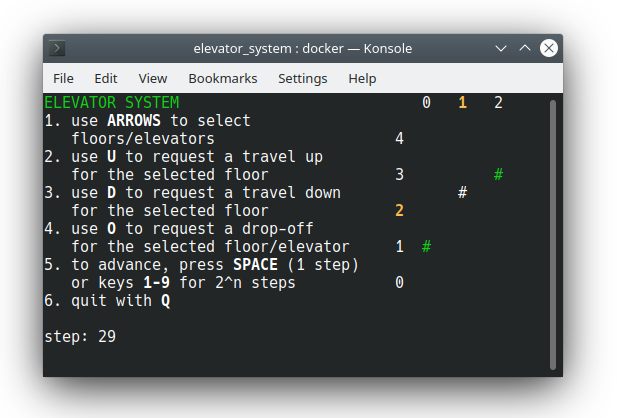

# cli_client
A CLI interface/visualisation of the algorithm. Built with `elevator_system`, `avs_commons` and `ncurses`.

## Building
Run `make`.

## Docker
This application is available as a Docker image, based on Alpine Linux/musl. To build the image locally, run `docker build .` in the root of the repository.

## Interface

